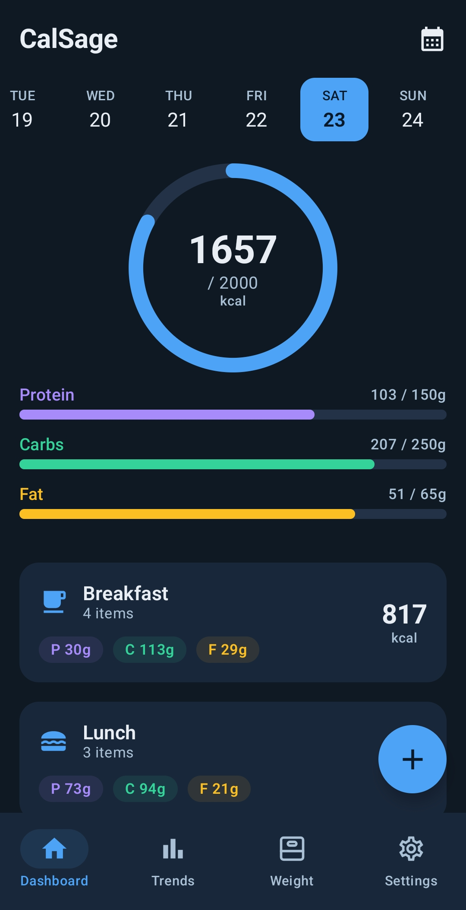
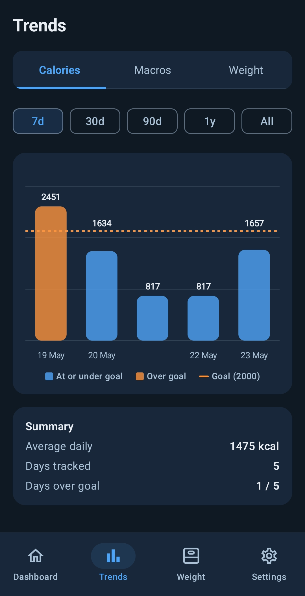
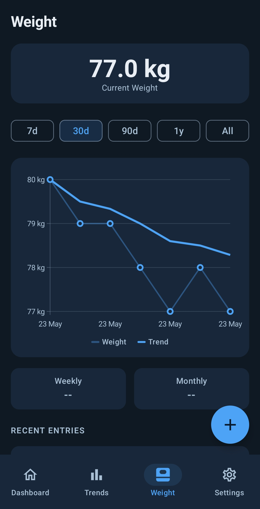
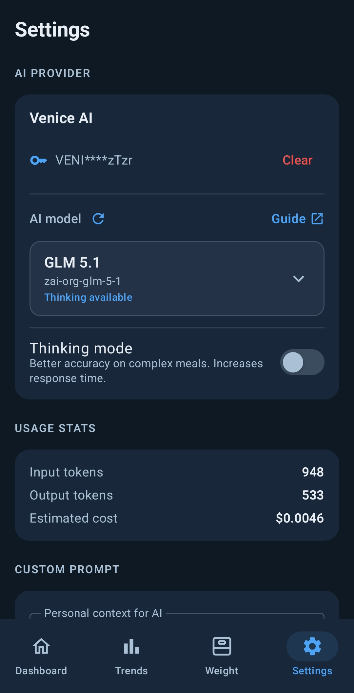

<h1 align="center">CalSage</h1>

<p align="center">
  Distraction-free calorie, macro and weight tracking for Android with Venice AI integration.
</p>

<p align="center">
  <a href="https://github.com/ropinjo/calsage/releases/latest">Download latest APK</a>
</p>

<p align="center">
  
  
  
  
  
</p>

## About

Powered by [Venice AI](https://venice.ai/chat?ref=y2qW1J).

CalSage is a native Android calorie tracker built with Kotlin and Jetpack Compose. It helps you log meals, monitor calories and macros, track weight changes, and review nutrition trends over time without signups, ads, tracking, or annoying notifications.

Your Venice API key is all you need for AI-assisted nutrition lookup and distraction-free tracking.

## Privacy

CalSage stores app data locally on your device. Barcode lookup and AI-assisted nutrition lookup use internet access only when you choose those features, and AI lookup is configured with your own Venice API key.

## Features

**NO ADS, NO TRACKING, NO SIGNUPS, FULL VENICE AI PRIVACY**

- Track daily calories, protein, carbs, and fat
- Log meals manually
- Scan barcodes for packaged foods
- Use AI-assisted nutrition lookup with a Venice API key
- Save and reuse favorite meals
- Track weight history
- Review progress with trends and charts
- Import and export CSV backups
- Store app data locally on device

## Screenshots

| Dashboard | Trends | Weight | Settings |
| --- | --- | --- | --- |
|  |  |  |  |

## Requirements

- Android 8.0 or newer
- Camera permission only for barcode scanning
- Internet access only for barcode lookup and AI-assisted nutrition lookup
- Venice API key only for AI-assisted nutrition lookup

## Download

Download the latest APK from the [GitHub Releases](https://github.com/ropinjo/calsage/releases/latest) page.

## Building

Clone the repository:

```bash
git clone https://github.com/ropinjo/calsage.git
cd calsage
```

Build a debug APK:

```bash
./gradlew assembleDebug
```

Build a signed release APK after configuring Android release signing:

```bash
./gradlew assembleRelease
```

Generated APKs are written under:

```text
app/build/outputs/apk/
```

## Status

CalSage is currently in beta. Features and data formats may still change between releases.

## License

CalSage is released under the [MIT License](LICENSE).
